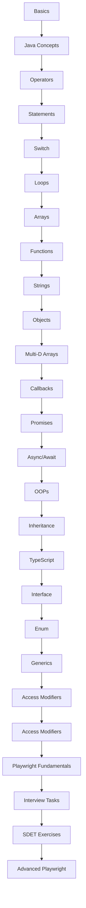

# 🚀 LearningPlaywright

Example repository for JavaScript learning snippets used with TheTestingAcademy tutorials. This project provides a structured journey from beginner-to-advanced JavaScript, TypeScript, and SDET-focused Playwright exercises.

## 📌 Table of Contents
- [Project Structure](#project-structure)
- [Learning Path](#learning-path)
- [Concept Quick-Reference](#concept-quick-reference)
- [Chapter Reference](#chapter-reference)
- [Thematic Organization](#thematic-organization)
- [Key Concepts](#key-concepts)
- [Getting Started](#getting-started)
- [Chapter Summaries](#chapter-summaries)
- [Prerequisites](#prerequisites)

---

## 📂 Project Structure

```text
LearningPlaywright/
├── chapter_01_Basics/          — JS environment setup and first steps
├── chapter_02_Java_Concepts/   — var/let/const, hoisting, scope
├── chapter_03_Iden_Lit_Op/      — identifiers, literals, operators
├── chapter_04_Operators/       — arithmetic, logical, ternary, type
├── chapter_05_Statements/       — if/else conditions
├── chapter_06_Switch/          — switch statements and fall-through
├── chapter_07_Loops/            — for, while, do-while loops
├── chapter_08_Arrays/          — map, filter, reduce, sort, destructure
├── chapter_09_Functions/       — arrow fn, closures, HOF, callbacks
├── chapter_10_Strings/         — manipulation, template literals
├── chapter_11_Objects/         — properties, getters/setters, this
├── chapter_12_MD_Arrays/       — 2D/3D arrays and patterns
├── chapter_13_Callbacks/       — sync/async callbacks, callback hell
├── chapter_14_Promises/         — Promise.all/race, error handling
├── chapter_15_Async_Await/     — sequential/parallel execution
├── chapter_16_OOps/            — classes, modules, encapsulation
├── chapter_17_Inheritance/     — single, multi-level, hierarchical
├── chapter_18_Typescript/       — types, interfaces, type safety
├── chapter_19_TS_Interface/    — interface inheritance, implements
├── chapter_20_TS_Enum/         — const enum, string/numeric enum
├── chapter_21_TS_Generics/     — generic functions, interfaces, classes
├── chapter_22_TS_Access/      — private, protected, public, readonly
├── chapter_23_Playwright_Fund/   — Playwright setup, basics and fundamental tests
├── Task_Interview_Coding/       — array, loop, function challenges
├── Test_JS_Part2/              — SDET coding exercises
├── Test_Playwright_Part3/      — Playwright advanced exercises
└── package.json, tsconfig.json, README.md
```

---

## 🗺️ Learning Path


*(If mermaid is not supported, see the logical flow: Fundamentals → Data Structures → Async → OOP → TypeScript → Practice)*

---

## ⚡ Concept Quick-Reference

### 📦 JavaScript Data Types
- **Primitive**: `String`, `Number`, `Boolean`, `Null`, `Undefined`, `BigInt`, `Symbol`
- **Reference**: `Object`, `Array`, `Function`

### 🏗️ Hoisting Behavior
```javascript
// BEFORE HOISTING
console.log(x);  // ReferenceError
var x = 10;

// AFTER HOISTING (How JS Engine interprets it)
var x;              // Declaration hoisted, value = undefined
console.log(x);     // Output: undefined
var x = 10;         // Assignment happens here
```

### ⏳ Promise States
`Pending` $\rightarrow$ `Fulfilled` (`.then`) | `Rejected` (`.catch`) $\rightarrow$ `Settled` (`.finally`)

### 🛡️ TypeScript Type System
`any` $\rightarrow$ `unknown` $\rightarrow$ `Primitive` $\rightarrow$ `Union/Intersection` $\rightarrow$ `Array` $\rightarrow$ `Interface` $\rightarrow$ `Class`

---

## 📚 Chapter Reference

| Chapters | Topic | Difficulty | Focus |
| :--- | :--- | :--- | :--- |
| **01-07** | Fundamentals | 🟢 Beginner | Environment, variables, operators, control flow |
| **08-12** | Data Structures | 🟡 Intermediate | Arrays, functions, strings, objects |
| **13-15** | Async Programming | 🔴 Advanced | Callbacks, promises, async/await |
| **16-17** | OOP & Inheritance | 🟡 Intermediate | Classes, inheritance, encapsulation |
| **18-22** | TypeScript | 🔴 Adv-Int | Types, interfaces, enums, generics |
| **23** | Playwright Basics | 🟢 Beginner | Playwright setup, fundamental tests |

---

## 🧩 Thematic Organization

- **Fundamentals (Ch 1-7):** Environment, variables, operators, control flow, loops.
- **Data Structures (Ch 8-12):** Arrays, functions, strings, objects, multi-dimensional arrays.
- **Async Programming (Ch 13-15):** Callbacks, promises, async/await.
- **OOP & Patterns (Ch 16-17):** Classes, inheritance, encapsulation.
- **TypeScript (Ch 18-22):** Types, interfaces, enums, generics, access modifiers.
- **Playwright Fundamentals (Ch 23):** Browser automation basics and setup.
- **Practice (Ch 24+):** Interview questions, SDET exercises, Playwright.

---

## ⚠️ Key Concepts

> [!IMPORTANT]
> - **Arrow Functions**: Do not have their own `this` context.
> - **Hoisting**: `var` is hoisted as `undefined`; `let`/`const` are in the **Temporal Dead Zone (TDZ)**.
> - **Promises**: Always handle errors using `.catch()` or `try...catch` with async/await.
> - **Closures**: A function remembers the environment (outer variables) in which it was created.

---

## 🚀 Getting Started

### 1. Install Dependencies
```bash
npm install
```

### 2. Run a JavaScript Example
```bash
node chapter_01_Basics/01_basic.js
```

### 3. Compile TypeScript
```bash
npx tsc
```

### 4. Setup Playwright (Optional)
```bash
npm install -D @playwright/test
npx playwright install
```

---

## 📝 Chapter Summaries

| Chapter | Summary |
| :--- | :--- |
| `01_Basics` | Environment setup, hello world, JS execution |
| `02_Java_Concepts` | var/let/const, hoisting, scope, TDZ |
| `03_Iden_Lit_Op` | typeof, == vs ===, null vs undefined |
| `04_Operators` | Arithmetic, logical, ternary, type operators |
| `05_Statements` | if/else, nested conditions, real-world examples |
| `06_Switch` | switch, case, default, fall-through |
| `07_Loops` | for, while, do-while, increment/decrement |
| `08_Arrays` | Creation, map, filter, reduce, sort, destructure |
| `09_Functions` | Arrow fn, closures, HOF, callbacks, IIFE |
| `10_Strings` | slice, trim, replace, split, template literals |
| `11_Objects` | Properties, descriptors, spread, getters/setters |
| `12_MD_Arrays` | 2D/3D arrays, patterns, pyramid exercises |
| `13_Callbacks` | Sync/async callbacks, callback hell, pyramid of doom |
| `14_Promises` | Creation, states, Promise.all/race, error handling |
| `15_Async_Await` | Sequential/parallel execution, try/catch, retry |
| `16_OOps` | Classes, modules, encapsulation, static members |
| `17_Inheritance` | Single, multi-level, hierarchical, multiple |
| `18_Typescript` | Types, interfaces, classes, type safety |
| `19_TS_Interface` | Interface inheritance, implements |
| `20_TS_Enum` | const enum, string/numeric enum |
| `21_TS_Generics` | Generic functions, interfaces, classes |
| `22_TS_Access` | private, protected, public, readonly |
| `23_Playwright_Fund` | Playwright installation, config, and basic tests |
| `Task_Interview` | Array, loop, function coding challenges |
| `Test_JS_Part2` | SDET-style coding and test logic exercises |
| `Test_Playwright` | Advanced Playwright exercises with browser planning |

---

## 🛠️ Prerequisites
- **Node.js**: 18+ recommended
- **TypeScript**: `npm install -g typescript`
- **IDE**: VS Code (Recommended)

---

## 🗒️ Notes
- Files are learning snippets and intentionally concise.
- The content is designed to be converted into Playwright tests or reorganized into a professional test suite.
- `package-lock.json` ensures reproducible dependency installations.
